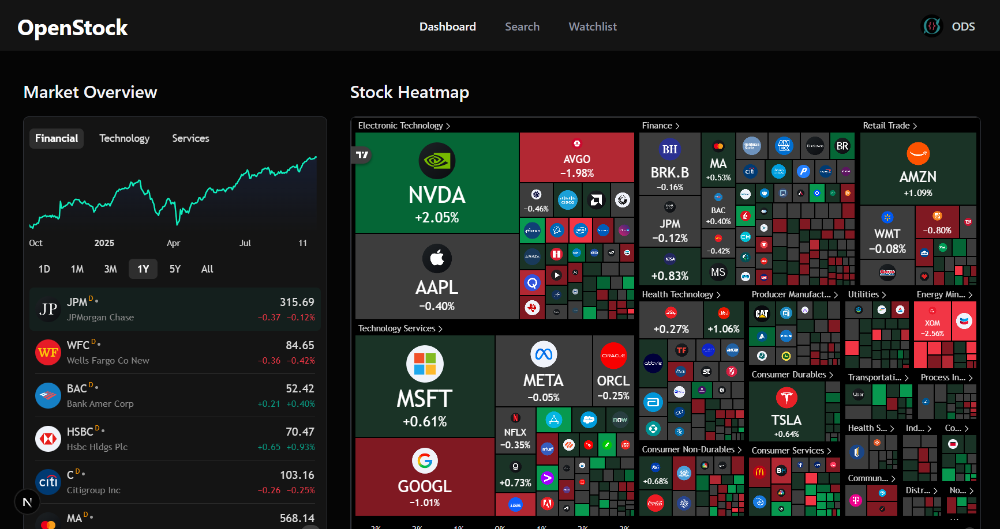

<div align="center">
  <br />
  <a href="#" target="_blank">
    
  </a>
  © Open Dev Society. This project is licensed under AGPL-3.0; if you modify, redistribute, or deploy it (including as a web service), you must release your source code under the same license and credit the original authors.
  <br />
  <br/>

  <div>
    
    
    
    
    
    
    
    
    
    
    
  </div>
</div>

# OpenStock Frontend

OpenStock is an open-source alternative to expensive market platforms. Track real-time prices, set personalized alerts, and explore detailed company insights — built openly, for everyone, forever free.

**Note**: This is the frontend repository. The backend API is now powered by Spring Boot. See the [Backend Repository](https://github.com/tranlong204/OpenStock-Backend) for the API server.

**Important**: OpenStock is community-built and not a brokerage. Market data may be delayed based on provider rules and your configuration. Nothing here is financial advice.

## 📋 Table of Contents

1. ✨ [Introduction](#introduction)
2. 🌍 [Open Dev Society Manifesto](#manifesto)
3. ⚙️ [Tech Stack](#tech-stack)
4. 🔋 [Features](#features)
5. 🤸 [Quick Start](#quick-start)
6. 🔐 [Environment Variables](#environment-variables)
7. 🧱 [Project Structure](#project-structure)
8. 📡 [Data & Integrations](#data--integrations)
9. 🧪 [Scripts & Tooling](#scripts--tooling)
10. 🤝 [Contributing](#contributing)
11. 🛡️ [Security](#security)
12. 📜 [License](#license)
13. 🙏 [Acknowledgements](#acknowledgements)

## ✨ Introduction

OpenStock Frontend is a modern React application built with Next.js (App Router), shadcn/ui, and Tailwind CSS. It communicates with a Spring Boot backend API for authentication, data persistence, and market data integration.

## 🌍 Open Dev Society Manifesto <a name="manifesto"></a>

We live in a world where knowledge is hidden behind paywalls. Where tools are locked in subscriptions. Where information is twisted by bias. Where newcomers are told they're not "good enough" to build.

We believe there's a better way.

- Our Belief: Technology should belong to everyone. Knowledge should be open, free, and accessible. Communities should welcome newcomers with trust, not gatekeeping.
- Our Mission: Build free, open-source projects that make a real difference:
    - Tools that professionals and students can use without barriers.
    - Knowledge platforms where learning is free, forever.
    - Communities where every beginner is guided, not judged.
    - Resources that run on trust, not profit.
- Our Promise: We will never lock knowledge. We will never charge for access. We will never trade trust for money. We run on transparency, donations, and the strength of our community.
- Our Call: If you've ever felt you didn't belong, struggled to find free resources, or wanted to build something meaningful — you belong here.

Because the future belongs to those who build it openly.

## ⚙️ Tech Stack

**Frontend**
- Next.js 15 (App Router), React 19
- TypeScript
- Tailwind CSS v4 (via @tailwindcss/postcss)
- shadcn/ui + Radix UI primitives
- Lucide icons

**Backend Integration**
- Spring Boot REST API (separate repository)
- JWT authentication
- MongoDB for data persistence
- Finnhub API for market data
- TradingView embeddable widgets

**Development Tools**
- next-themes, cmdk (command palette), react-hook-form
- ESLint, TypeScript strict mode

**Language Composition**
- TypeScript (~93.4%), CSS (~6%), JavaScript (~0.6%)

## 🔋 Features

- **Authentication**
    - JWT-based authentication via Spring Boot backend
    - Protected routes with React context
    - Secure token management

- **Global Search and Command + K Palette**
    - Fast stock search backed by Finnhub API
    - Popular stocks when idle; debounced querying
    - Keyboard shortcuts (Cmd/Ctrl + K)

- **Watchlist Management**
    - Per-user watchlist stored in MongoDB via backend API
    - Real-time updates and synchronization

- **Stock Details**
    - TradingView symbol info, candlestick/advanced charts, baseline, technicals
    - Company profile and financials widgets
    - Real-time price updates

- **Market Overview**
    - Heatmap, quotes, and top stories (TradingView widgets)
    - Market news integration

- **Personalized Experience**
    - Dark theme by default
    - Responsive design with shadcn/ui components
    - Smooth animations and transitions

## 🤸 Quick Start

### Prerequisites
- Node.js 20+ and pnpm or npm
- Spring Boot backend running (see [Backend Repository](https://github.com/tranlong204/OpenStock-Backend))
- MongoDB instance (local or Atlas)
- Finnhub API key (free tier supported)

### Clone and Install
```bash
git clone https://github.com/tranlong204/OpenStock.git
cd OpenStock

# choose one:
pnpm install
# or
npm install
```

### Configure Environment
Create a `.env.local` file in the project root:
```env
# Backend API Configuration
NEXT_PUBLIC_API_BASE_URL=http://localhost:8080/api

# Optional: Override default API endpoints
NEXT_PUBLIC_API_TIMEOUT=10000
```

### Start Development
```bash
# Start the frontend development server
pnpm dev
# or
npm run dev
```

### Start Backend
Make sure the Spring Boot backend is running:
```bash
# In the backend repository
cd ../OpenStock-Backend
./start.sh
```

Open http://localhost:3000 to view the app.

## 🔐 Environment Variables

Create `.env.local` at the project root:

```env
# Backend API Configuration
NEXT_PUBLIC_API_BASE_URL=http://localhost:8080/api

# Optional: API timeout (milliseconds)
NEXT_PUBLIC_API_TIMEOUT=10000

# Optional: Enable debug logging
NEXT_PUBLIC_DEBUG=false
```

**Notes:**
- All `NEXT_PUBLIC_` variables are exposed to the browser
- The backend handles all sensitive operations (authentication, database access, API keys)
- For production, update `NEXT_PUBLIC_API_BASE_URL` to point to your deployed backend

## 🧱 Project Structure

```
app/
  (auth)/
    layout.tsx
    sign-in/page.tsx
    sign-up/page.tsx
  (root)/
    layout.tsx
    page.tsx
    help/page.tsx
    stocks/[symbol]/page.tsx
  globals.css
  layout.tsx
components/
  ui/…          # shadcn/radix primitives (button, dialog, command, input, etc.)
  forms/…       # InputField, SelectField, CountrySelectField, FooterLink
  Header.tsx, Footer.tsx, SearchCommand.tsx, WatchlistButton.tsx, …
lib/
  api-client.ts     # Centralized API client for backend communication
  auth-context.tsx  # JWT authentication context
  config.ts         # API configuration and endpoints
  constants.ts, utils.ts
hooks/
  useDebounce.ts
  useTradingViewWidget.tsx
types/
  global.d.ts
next.config.ts          # i.ibb.co image domain allowlist
postcss.config.mjs      # Tailwind v4 postcss setup
components.json         # shadcn config
public/assets/images/   # logos and screenshots
```

## 📡 Data & Integrations

- **Spring Boot Backend**
    - RESTful API for all data operations
    - JWT authentication and authorization
    - MongoDB integration for persistence
    - Finnhub API integration for market data

- **Finnhub**
    - Stock search, company profiles, and market news
    - Integrated via backend API
    - Free tiers may return delayed quotes; respect rate limits

- **TradingView**
    - Embeddable widgets for charts, heatmap, quotes, and timelines
    - External images from `i.ibb.co` are allowlisted in `next.config.ts`

- **Authentication Flow**
    - JWT tokens managed via React context
    - Automatic token refresh and logout on expiration
    - Protected routes with authentication checks

## 🧪 Scripts & Tooling

**Package Scripts**
- `dev`: Next.js dev server with Turbopack
- `build`: Production build (Turbopack)
- `start`: Run production server
- `lint`: ESLint

**Developer Experience**
- TypeScript strict mode
- Tailwind CSS v4 (no separate tailwind.config needed)
- shadcn/ui components with Radix primitives
- cmdk command palette, next-themes, lucide-react icons

## 🤝 Contributing

You belong here. Whether you're a student, a self-taught dev, or a seasoned engineer — contributions are welcome.

- Open an issue to discuss ideas and bugs
- Look for "good first issue" or "help wanted"
- Keep PRs focused; add screenshots for UI changes
- Be kind, guide beginners, no gatekeeping — that's the ODS way

## 🛡️ Security

If you discover a vulnerability:
- Do not open a public issue
- Email: opendevsociety@cc.cc
- We'll coordinate responsible disclosure and patch swiftly

## 📜 License

OpenStock is and will remain free and open for everyone. This project is licensed under AGPL-3.0; if you modify, redistribute, or deploy it (including as a web service), you must release your source code under the same license and credit the original authors.

## 🙏 Acknowledgements

- Finnhub for accessible market data
- TradingView for embeddable market widgets
- shadcn/ui, Radix UI, Tailwind CSS, Next.js community
- Spring Boot community for robust backend framework
- All contributors who make open tools possible

— Built openly, for everyone, forever free. Open Dev Society.

## Our Honourable Contributors

- [ravixalgorithm](https://github.com/ravixalgorithm) - Developed the entire application from the ground up, including authentication, UI design, API and AI integration, and deployment.
- [Priyanshuu00007](https://github.com/Priyanshuu00007) - Created the official OpenStock logo and contributed to the project's visual identity.
- [chinnsenn](https://github.com/chinnsenn) - Set up Docker configuration for the repository, ensuring a smooth development and deployment process.
- [koevoet1221](https://github.com/koevoet1221) - Resolved MongoDB Docker build issues, improving the project's overall stability and reliability.

## Special Thanks

Huge thanks to [Adrian Hajdin (JavaScript Mastery)](https://github.com/adrianhajdin) — his excellent Stock Market App tutorial was instrumental in building OpenStock for the open-source community under the Open Dev Society.

GitHub: [adrianhajdin](https://github.com/adrianhajdin)
YouTube tutorial: [Stock Market App Tutorial](https://www.youtube.com/watch?v=gu4pafNCXng)
YouTube channel: [JavaScript Mastery](https://www.youtube.com/@javascriptmastery)

## Backend Repository

The backend API is now powered by Spring Boot and is available in a separate repository:
- **Backend Repository**: [https://github.com/tranlong204/OpenStock-Backend](https://github.com/tranlong204/OpenStock-Backend)
- **API Documentation**: Available in the backend repository
- **Deployment**: Both frontend and backend can be deployed independently